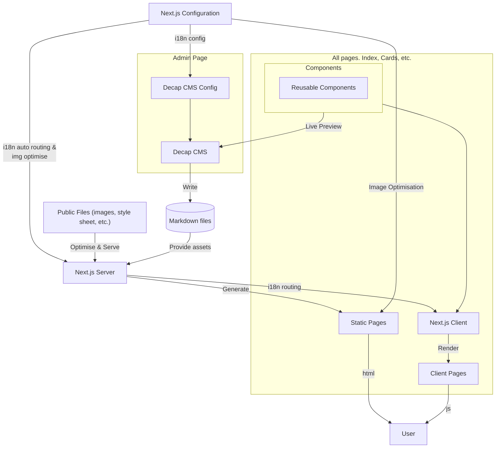

# 貢獻專案

## 系統需求

| 工具 | 版本 |
| ---: | ---: |
| Node | >=14 |
| yarn | >=2 |

若尚未安裝 Node，請前往[此處](https://nodejs.org/en/)進行安裝。
若尚未安裝 Yarn 或版本過舊，請前往[此處](https://yarnpkg.com/getting-started/install)進行安裝。

## 網站架構



## 部署

本專案使用 Netlify 與 Netlify Next.js runtime 進行部署，帶來以下優勢：

- 分支預覽部署 (Branch Preview Deployment) 讓您可以預覽每個 Git 分支的變更。
- 使用 [Netlify Identity](https://docs.netlify.com/security/secure-access-to-sites/identity/) 和 [Git Gateway](https://docs.netlify.com/security/secure-access-to-sites/git-gateway/) 管理非 GitHub 使用者的網頁編輯權限。

如果您不熟悉 Netlify，請參考[Netlify 文件](https://docs.netlify.com/)。

### 主要網站

[https://openstartervillage.netlify.app](https://openstartervillage.netlify.app)

### Canary 版本

為了在不直接影響主要網站的情況下測試新的 CI/CD 流程，我們使用 Canary 版本。

[https://openstartervillage-canary.netlify.app](https://openstartervillage-canary.netlify.app)

> Canary 版本會在每次推送到 `main` 分支時自動部署。它具有與主要網站相同的環境變數，但其網址不會被列入搜尋引擎索引。

## 開發前置流程

### 複製專案

```shell
git clone https://github.com/ocftw/open-star-ter-village.git
cd open-star-ter-village
```

### 安裝開發環境所需的套件

```shell
cd homepage
yarn
```

## 開發專案

本專案使用 Next.js 架構，若您不熟悉 Next.js，請參考[Next.js 文件](https://nextjs.org/docs/getting-started)。若需更深入了解不同方面，可查看以下文件：

- [Next.js `getStaticProps`](https://nextjs.org/docs/basic-features/data-fetching#getstaticprops-documentation)
- [i18n 設定](https://nextjs.org/docs/advanced-features/i18n-routing)
- [圖片最佳化](https://nextjs.org/docs/basic-features/image-optimization)

### 開發模式

> 若要在本地端開發並測試 CMS，需要先在 **開源星手村 git 專案根目錄** 啟動 `decap-server`：
>
> ```shell
> cd ../ # 返回 open-star-ter-village (git 根目錄)
> npx decap-server
> ```

以下指令將立即監控 `src/` 和 `public/` 資料夾中的檔案，並啟動本地網頁伺服器，用於測試和預覽結果。伺服器預設運行於端口 3000。<http://localhost:3000>

```shell
yarn dev
```

### 建置發布版本

```shell
yarn build
```

### 啟動伺服器端

```shell
yarn start
```

## Decap CMS 設定

Decap CMS 是一個用於網站內容管理的工具。若您希望深入了解如何設定 Decap CMS 中的 collection、widget、i18n，您可以參考以下文件：

- [Decap CMS local backend 設定](https://decapcms.org/docs/beta-features/#working-with-a-local-git-repository)
- [Decap CMS Collection 設定](https://decapcms.org/docs/collection-types/)
- [Decap CMS Widget 設定](https://decapcms.org/docs/widgets/)
- [Decap CMS i18n 設定](https://decapcms.org/docs/beta-features/#i18n-support)

## 其他功能設定

### 網站分析

網站分析使用 Google Tag Manager 進行設定，主要用於分析網站流量。主要的設定檔案為 [`src/lib/service/gtm.js`](./src/lib/service/gtm.js)，使用於 [`src/pages/_app.jsx`](./src/pages/_app.jsx) 與 [`src/pages/_document.jsx`](./src/pages/_document.jsx)。

### 網站 SEO

網站 SEO 僅有在 [`public/sitemap.xml`](./public/sitemap.xml) 與 [`public/robots.txt`](./public/robots.txt) 中設定，由於頁面還沒擴增到完全由 CMS 產生，尚未以[`src/pages/sitemap.xml.js`](./src/pages/sitemap.xml.js)的方式即時生成 sitemap。若您希望更深入了解如何設定網站 SEO，您可以參考以下文件：

- <https://nextjs.org/learn-pages-router/seo/crawling-and-indexing/xml-sitemaps>
- <https://nextjs.org/learn-pages-router/seo/crawling-and-indexing/robots-txt>
