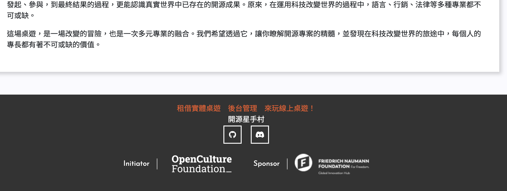
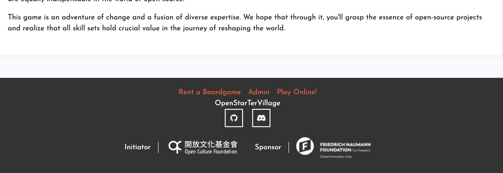
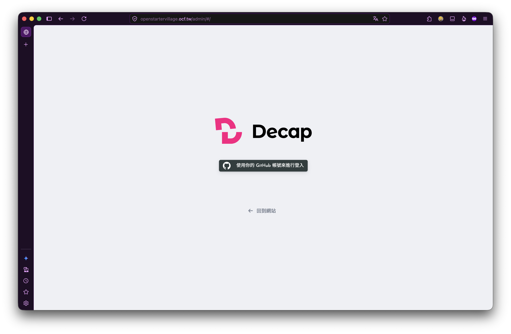
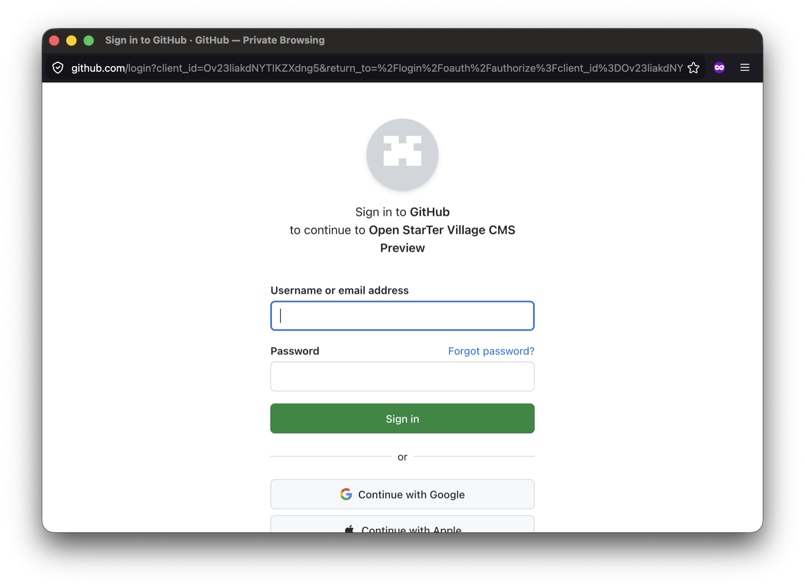
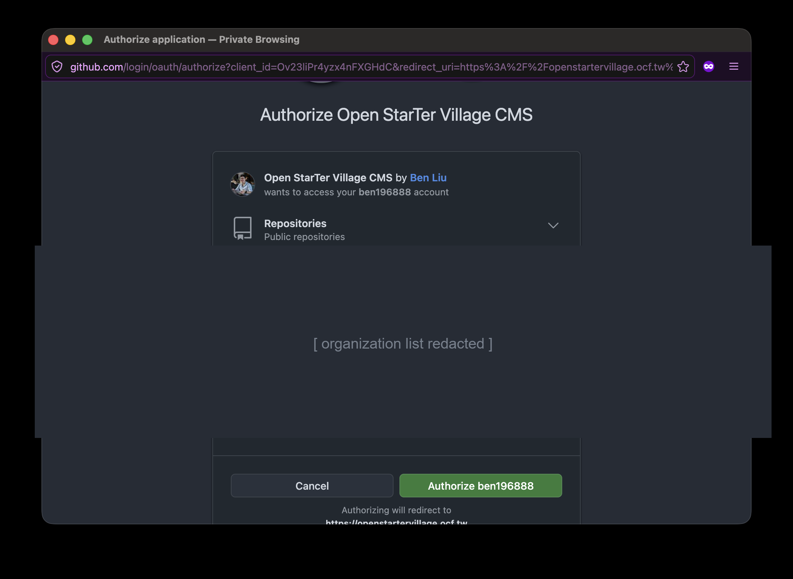
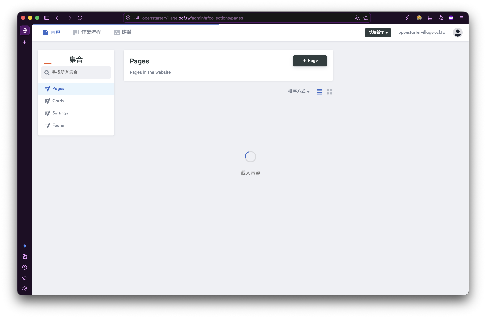

# 開源星手村 首頁

版本紀錄請參閱 [`CHANGELOG.md`](./CHANGELOG.md)。

目前，模板設計基於 [首頁 wireframe](https://drive.google.com/file/d/1mHfiHLZPNvAGKtlY788Ojkmap9SXupH-/view?usp=sharing)，並使用 [Bootstrap v4.6.x](https://getbootstrap.com/docs/4.6/getting-started/introduction/) 和 [Font Awesome v5.15.4](https://fontawesome.com/v5/docs) 進行 CSS 設計。

專案目前部署於 Netlify 上，Netlify有提供免費的[網域](https://openstartervillage.netlify.app/)，並且支援[自動部署](https://docs.netlify.com/site-deploys/overview/)，因此專案的部署流程相當簡單。

同時，專案也支援[多語言](https://nextjs.org/docs/advanced-features/i18n-routing)，並且使用 [Decap CMS](https://decapcms.org/) 作為網站內容管理工具。

## 專案設定

- Runtime：Node.js >= 24
- Package manager：pnpm 11.15.1（repository root workspace）
- Framework：Next.js 16
- CMS：Decap CMS

常用指令：

```bash
pnpm homepage dev         # 啟動開發伺服器
pnpm homepage build       # 建置網站
pnpm homepage start       # 啟動 production server
pnpm homepage lint        # Prettier check + ESLint
pnpm homepage lint:fix    # 自動修正格式與 lint 問題
pnpm homepage test:admin  # 驗證 production build 的 Decap CMS shell
pnpm homepage test:visual # 比對 public pages 的 Playwright 視覺快照
```

## 💫 部署

Netlify 必須從 repository 根目錄讀取 `pnpm-lock.yaml` 與 `netlify.toml`：

- Base directory 保持空白（repository root）。
- Package directory 設為 `homepage`。
- Build command 與 Publish directory 由根目錄的 `netlify.toml` 管理。

[](https://app.netlify.com/start/deploy?repository=https://github.com/ocftw/open-star-ter-village)

### 線上展示

[](https://app.netlify.com/sites/openstartervillage/deploys)

[https://openstartervillage.netlify.app/](https://openstartervillage.netlify.app/)

## 網域設定

開源星手村在ocf.tw底下有一個子網域，網址為[https://openstartervillage.ocf.tw/](https://openstartervillage.ocf.tw/)，目前已經將此網址導向至Netlify。

## 🚀 快速開始

### 參與合作/貢獻方式

歡迎加入[Discord](https://discord.gg/JnTHGnxwYS)，於 #村長辦公室 與 #基礎建設部 提出您的見解並參與討論！

### 網站開發

若您對網站開發有興趣，歡迎參考以下資訊。

- [官方網站進度規劃](https://github.com/ocftw/open-star-ter-village/wiki/Homepage-Roadmap)

#### 開發前需了解的事項

請參考[CONTRIBUTING.md](./CONTRIBUTING.md)。

#### 驗證 CMS 後台改動：使用 `cms-preview` 分支

**Deploy Preview（`deploy-preview-<PR 編號>--…`）無法登入 `/admin`。** 這是預期行為，不是壞掉了。

GitHub OAuth App 只能註冊**一組** callback URL，而 Deploy Preview 的網域每個 PR 都不同。GitHub 也沒有提供修改 OAuth App 設定的 REST API，因此無法為每個 PR 自動註冊。callback 固定指向下方這組固定網域，所以在 Deploy Preview 登入會在授權後出現 `redirect_uri_mismatch`。

Deploy Preview 的**公開頁面完全正常**，僅 `/admin` 登入不可用。

驗證後台改動請使用專屬的 `cms-preview` 分支部署：

<https://cms-preview--openstartervillage.netlify.app/admin/>

部署方式（擇一）：

- GitHub Actions → **Deploy CMS Preview** → Run workflow，輸入要部署的 ref
- 直接推送到 `cms-preview` 分支

此分支僅供開發驗證。**一般內容編輯者請一律使用正式站的後台**，見下方「網站內容編輯」。

`cms-preview` 的 `backend.branch` 仍指向 `main`，因此在此分支後台所做的修改，Pull Request 一樣會開向 `main`。測試完請記得關閉這些 PR。

### 網站內容編輯

- [網站編輯說明](https://github.com/ocftw/open-star-ter-village/wiki/%E7%B6%B2%E7%AB%99%E7%B7%A8%E8%BC%AF%E8%AA%AA%E6%98%8E-%E2%80%90-How-to-Edit-Homepage)

#### 找到後台入口

網站頁尾有「**後台管理**」連結，點擊即可前往內容管理後台。



英文版頁尾則是「**Admin**」連結。



也可以直接開啟 <https://openstartervillage.ocf.tw/admin/>。

#### 登入內容管理後台

登入方式為 **GitHub 帳號**。過去使用的 Netlify Identity 共用帳號已停用，改用 GitHub 帳號後，每一次內容修改都會記錄在你自己的名下。

1. 開啟後台後，點擊「**使用你的 GitHub 帳號來進行登入**」

   

2. 若尚未登入 GitHub，會先出現 GitHub 登入畫面，標題為 **Sign in to GitHub to continue to Open StarTer Village CMS**。輸入帳號密碼後點擊 **Sign in**

   

3. 首次登入時 GitHub 會詢問是否授權此應用程式，點擊 **Authorize**。之後再次登入不會重複詢問

   

4. 授權完成後會自動回到後台，左側會列出可編輯的集合（Pages／Cards／Settings／Footer）

   

授權範圍為 `public_repo`，僅能存取公開的 repository，不會取得你其他私人專案的權限。

#### 你需要什麼權限？

**任何擁有 GitHub 帳號的人都可以直接編輯內容，不需要事先申請權限。**

系統採用 Decap CMS 的 open authoring 模式，依你在 `ocftw/open-star-ter-village` 的角色自動分流：

| 你的角色                      | 登入後的行為                                       | 能否直接發布               |
| ----------------------------- | -------------------------------------------------- | -------------------------- |
| 沒有 repo 權限（一般貢獻者）  | CMS 自動幫你 fork 一份 repo，修改存在你自己的 fork | 否，送出後由維護者審核合併 |
| 具備 Write 以上權限（維護者） | 直接在主 repo 建立分支                             | 是                         |

一般貢獻者的作業流程只會看到兩欄（草稿、準備完成）；維護者會看到完整三欄。

#### 編輯與送審流程

1. 於「內容」選擇要修改的集合（Pages／Cards／Settings／Footer）
2. 修改欄位，右側會即時顯示預覽
3. 存檔後於「作業流程」把項目移到「**準備完成**」，系統會建立 Pull Request
4. 維護者審核並合併後，Netlify 自動部署上線

目前已知限制：一般貢獻者上傳新圖片的行為尚未驗證，如需新增圖片素材，請在 Discord 聯繫維護者處理。

Decap CMS 支援 Markdown 語法，如對此不熟悉可參考以下兩個網站學習 Markdown 語法，並透過 [markdown playground](https://hackmd.io/2OBWFw_FSiazt4JxoINNlQ?both) 進行練習。

- <https://markdown.tw/> （注意：此網頁在手機和小螢幕裝置上的排版支援有限）
- <https://www.casper.tw/development/2019/11/23/ten-mins-learn-markdown/>

#### 想要取得直接發布權限（進階）

多數人不需要這一步，一般貢獻者透過上方的 fork + PR 流程即可完成編輯。

若你需要跳過審核直接發布，需取得 `ocftw/open-star-ter-village` 的 **Write** 角色。這是 GitHub 的 repo 權限，不是 CMS 內的設定，無法自行開通，需要由組織管理者授予：

1. 於 [Discord](https://discord.gg/JnTHGnxwYS) #基礎建設部 提出申請，附上你的 GitHub 帳號名稱
2. 組織管理者於 **GitHub → ocftw/open-star-ter-village → Settings → Collaborators and teams** 邀請你，角色選擇 **Write**
3. 你會收到邀請信，接受後重新登入後台即可看到完整三欄作業流程

請注意 GitHub 的 repo 權限是整個 repository 共用的，無法只針對 `homepage/` 目錄授權。若你只需要修改內容，使用上表的一般貢獻者流程即可，不需要 Write 權限。

### 增加新語言/修改語言代碼/刪除語言

1. 增加語言於 [`next.config.js`](./next.config.js) 中的 `i18n.locales` 陣列中。語言代碼請參考 [BCP 47](https://www.w3.org/International/questions/qa-choosing-language-tags#question), [ISO 639-1](https://en.wikipedia.org/wiki/List_of_ISO_639-1_codes), [ISO 639-2](https://en.wikipedia.org/wiki/List_of_ISO_639-2_codes), [ISO 639-3](https://en.wikipedia.org/wiki/List_of_ISO_639-3_codes)

目前支援的語言有 `zh-Hant`, `en`。

```js
// next.config.js
i18n: {
  locales: ['zh-Hant', 'en'],
  defaultLocale: 'zh-Hant',
},

// decap-cms.config.js
// decap cms i18n inherits from next.config.js
i18n: {
  structure: 'multiple_folders',
  locales: nextConfig.i18n.locales,
  default_locale: nextConfig.i18n.defaultLocale,
},
```

> Decap cms中的語言陣列與預設語言是沿用next.config.js中的設定，因此在next.config.js中新增語言後，decap cms會自動套用新增的語言。
>
> 語言陣列中的語言順序為decap cms中的編輯文件的語言順序。

2. 修改語言代碼需同時修改 `next.config.js` 中的 `i18n.locales` 並將 [`_cards`](./_cards/), [`_footer`](./_footer/), [`_pages`](./_pages/) 資料夾中底下的語言資料夾名稱一併修改。

例如：將 `zh-tw` 修改為 `zh-hant`，則 `_cards`, `_footer`, `_pages` 底下的 `zh-tw` 資料夾名稱也需一併修改為 `zh-hant`。

> Decap cms中的語言陣列與預設語言是沿用next.config.js中的設定，因此在next.config.js中修改語言後，decap cms會自動套用修改。
>
> 語言資料夾名稱需與 `next.config.js` 中的 `i18n.locales` 陣列中的語言代碼一致。
>
> 如果`defaultLocale`是`zh-tw`，則在`zh-tw`修改為`zh-hant`時，需要同時修改`defaultLocale`為`zh-hant`。
>
> 在 [`public/_redirects`](./public/_redirects) 中新增一個重新導向規則，將舊的語言代碼導向到新的語言代碼。例如，如果您將 `zh-tw` 更改為 `zh-hant`，則應在 `public/_redirects` 中添加 `/zh-tw/* /zh-hant/:splat 301!`。

## 其他連結

- [開源新手村 ★ 入村總綱領](https://hackmd.io/1B3eCm8sSbqDTdcMI7o85g)
- [共用資料夾區](https://drive.google.com/drive/folders/1d2rlxRLQ_iUVhq9-ZO7BGCjTl1ES2zf6)

## 靈感來源

- [RG-Portfolio gatsby starter](https://github.com/Rohitguptab/rg-portfolio.git)
- [Creating a static website with ReactJS and renderToStaticMarkup()](https://www.codemzy.com/blog/static-website-react-rendertostaticmarkup)
- [亂數假文產生器 Chinese Lorem Ipsum](http://www.richyli.com/tool/loremipsum/)
- [Static Site Generation with React and Webpack](https://sking7.github.io/articles/945674580.html)
- [Benchmarking esbuild, swc, tsc, and babel for React/JSX projects](https://datastation.multiprocess.io/blog/2021-11-13-benchmarking-esbuild-swc-typescript-babel.html)
- [Why you should use SWC (and not Babel)](https://blog.logrocket.com/why-you-should-use-swc/)
- [Migrating to SWC: A brief overview](https://blog.logrocket.com/migrating-swc-webpack-babel-overview/)
- [Why Next.js switched from Babel to SWC](https://nextjs.org/blog/next-11-1#adopting-rust-based-swc)
- [Next.js documents](https://nextjs.org/docs/getting-started)
- [Next.js blogging template for Netlify](https://github.com/wutali/nextjs-netlify-blog-template)
- [unified](https://github.com/unifiedjs/unified)
- [remark](https://github.com/remarkjs/remark)
- [rehype](https://github.com/rehypejs/rehype)
- [How to build a blog with Next.js](https://dev.to/sagar/building-a-blog-with-next-js-253)
- [How to Internationalize Sites with Country-Based Redirects](https://www.netlify.com/blog/2021/11/05/how-to-internationalize-sites-with-country-based-redirects/)

## 特別感謝

[@binaryluke](https://github.com/binaryluke) 在 v2.0.0 階段提供網站架構想法。
