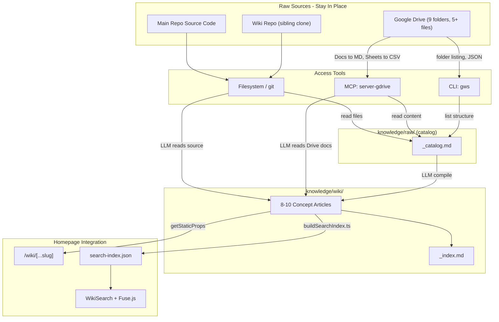

# RFC 004: LLM Knowledge Base & Wiki Book

**Status:** Draft
**Author:** @ben196888
**Created:** 2026-04-03
**Related:** [RFC 002](./002-agent-workflow-role-separation.md)

## Description

The project's knowledge is scattered across three disconnected locations: source code in the main repo, 8 markdown pages in a separate GitHub Wiki repo, and 9+ folders of documents on Google Drive. There is no unified view, no search, and no structured way to add new material. Contributors must manually navigate between GitHub, Google Drive, and the wiki to understand the project.

Inspired by the pattern described in Andrej Karpathy's "LLM Knowledge Bases" post — where raw data is collected, then compiled by an LLM into an interlinked markdown wiki — this RFC establishes an LLM-powered knowledge base for Open StarTer Village. Raw sources stay where they are; the LLM reads from all of them and compiles a wiki book of organized articles within the main repo, viewable and searchable from the homepage.

## Goals

- Catalog all project assets (source code, wiki repo, Google Drive) into a single master inventory without moving any files
- Compile an LLM-maintained wiki book (~8-10 interlinked markdown articles) from all raw sources
- Provide a `/add-file` command to incrementally ingest new material (markdown, Drive links, images, videos) and auto-update the wiki
- Provide a `/doctor` command to lint the wiki for broken links, stale content, and missing cross-references
- Integrate the wiki book into the homepage project with a viewer and client-side search
- Expose all capabilities through both Cursor skills and Claude Code slash commands
- Make the `knowledge/` folder compatible with Obsidian as a nice-to-have

## Non-Goals

- Moving or reorganizing Google Drive files (they stay on Drive)
- Per-file documentation of source code (one summary article instead)
- Moving wiki repo content into the main repo (the wiki repo stays as a sibling clone)
- Server-side search infrastructure (Algolia, ElasticSearch)
- RAG or vector database (not needed at this scale)
- Replacing the GitHub Wiki UI (it remains functional for direct edits)

## Solutions

### 1. Directory Structure

The wiki repo and Google Drive stay where they are. The `knowledge/` folder in the main repo holds only the **catalog** (raw/) and **compiled wiki book** (wiki/).

```
open-star-ter-village/
├── knowledge/
│   ├── raw/                          # Catalog + ingested files (article's raw/)
│   │   ├── _catalog.md              # Master inventory of all sources
│   │   └── files/                   # Ingested local files (via /add-file)
│   │       ├── *.md                 # Markdown articles, notes, clipped web pages
│   │       ├── *.png / *.jpg        # Images
│   │       └── *.mp4 / *.webm      # Videos
│   │
│   └── wiki/                         # LLM-compiled wiki book (article's wiki/)
│       ├── _index.md                 # Master index with summaries + backlinks
│       ├── project-overview.md       # Source code summary
│       ├── game-rules.md             # Game rules compiled from wiki + Drive
│       ├── game-mechanics.md         # Card types, phases, state model
│       ├── architecture.md           # Webapp + homepage tech overview
│       ├── roadmap.md                # Consolidated roadmap with status
│       ├── contributing.md           # How to contribute
│       ├── resources.md              # Google Drive catalog (links, descriptions)
│       └── homepage-editing.md       # CMS editing guide
│
├── .claude/commands/                 # Claude Code slash commands
│   ├── add-file.md                  # /add-file <path-or-url>
│   ├── doctor.md                    # /doctor [--fix]
│   └── build-search-index.md       # /build-search-index
│
├── .cursor/skills/knowledge-base/   # Cursor skill
│   ├── SKILL.md                     # Auto-triggers on KB-related queries
│   └── references/
│       └── catalog-format.md        # Catalog entry format spec
│
├── homepage/src/
│   ├── pages/wiki/
│   │   ├── index.jsx                # Wiki listing page
│   │   └── [...slug].jsx           # Dynamic wiki page renderer
│   ├── components/
│   │   └── WikiSearch.jsx           # Search UI component
│   └── lib/
│       ├── repository/
│       │   └── wikiRepository.js    # Read wiki .md at build time
│       └── service/
│           └── buildSearchIndex.ts  # Search index builder (importable + CLI)
│
└── scripts/wiki/
    ├── add_file.py                  # File ingestion mechanics
    └── doctor.py                    # Wiki health checker
```

**External sources (not in the main repo):**
- Wiki repo: `../open-star-ter-village.wiki/` (8 markdown files, sibling clone)
- Google Drive: [root folder](https://drive.google.com/drive/folders/1d2rlxRLQ_iUVhq9-ZO7BGCjTl1ES2zf6) (9 subfolders, 5+ files)

### 2. Raw Data Catalog

`knowledge/raw/_catalog.md` is an LLM-generated master inventory that catalogs every asset source **by reference**.

**Main repo** — monorepo structure overview (3 sub-projects, their roles, tech stacks). A summary, not an exhaustive per-file listing.

**Wiki repo** (8 pages, cataloged by reference):

| File | Content |
|------|---------|
| `Home.md` | Bilingual index; links to subprojects and roadmaps |
| `關於這個專案-‐-About.md` | Full game rules: flow, open star tree, 12 force cards, 18 event cards, FAQ |
| `專案規劃-‐-Roadmap.md` | Project-wide roadmap (stages 1-4) |
| `Homepage-Roadmap.md` | CMS integration stages, download materials |
| `Webapp-Roadmap.md` | Game logic checklist, TypeScript interfaces, UI wireframe |
| `網站編輯說明-‐-How-to-Edit-Homepage.md` | Decap CMS editing guide, block types, editorial workflow |
| `_Footer.md` / `_Sidebar.md` | External links (website, Discord, Drive folders) |

Path reference: `../open-star-ter-village.wiki/<filename>`. Four pages linked from Home.md are missing (Physical/Online intro & roadmap).

**Google Drive** — root folder `1d2rlxRLQ_iUVhq9-ZO7BGCjTl1ES2zf6` with 9 subfolders and 5 files:

| Folder | Description |
|--------|-------------|
| 2022 桌遊 活動文件與簡報 | Event documents & presentations |
| 官方網站區 | Official website section assets |
| 桌遊內容物資料（含租借範本）| Board game content incl. rental templates |
| 桌遊教學工具包 - Teaching Toolkit | Teaching toolkit for educators |
| 社群宣傳(含原ig宣傳帳號專區) | Community promotion materials |
| 視覺素材 | Visual materials (design assets) |
| 簡報集中區 | Presentation collection |
| 線上試玩表格設計 | Online playtest form design |
| 解謎用資料 | Puzzle materials |

Plus 13 individual Drive links referenced in the codebase (README, homepage resource page, wiki footer). Files stay on Drive; **content is read** via MCP or CLI at compilation time. Google Docs auto-convert to Markdown, Sheets to CSV.

### 3. Wiki Book Compilation

The LLM reads from all three raw sources and produces organized, interlinked articles in `knowledge/wiki/`.

**Compilation process:**
1. LLM reads wiki repo files via `../open-star-ter-village.wiki/`
2. LLM reads relevant main repo source files (CLAUDE.md, AGENTS.md, package.json, key entry points)
3. LLM reads Google Drive document content via the `@modelcontextprotocol/server-gdrive` MCP (Docs→Markdown, Sheets→CSV) or `gws` CLI for recursive folder listing
4. LLM produces ~8-10 wiki articles organized by concept
5. Each article includes summaries, backlinks to raw sources (including Drive links), and cross-links to other articles
6. `_index.md` serves as the auto-maintained master index with brief summaries of all articles

**Initial articles:**

| Article | Primary Sources | Content |
|---------|----------------|---------|
| `project-overview.md` | Main repo, CLAUDE.md, AGENTS.md | Monorepo summary, tech stack, sub-project roles |
| `game-rules.md` | wiki About page, Drive rules PDF | Game flow, actions, settle, end conditions |
| `game-mechanics.md` | wiki About page | Open star tree tiers, 12 force cards, 18 event cards, FAQ |
| `architecture.md` | CLAUDE.md, webapp source, homepage source | Two-process webapp, dual state systems, homepage SSG |
| `roadmap.md` | 3 wiki roadmaps | Consolidated project/webapp/homepage roadmap |
| `contributing.md` | CONTRIBUTING.md, wiki Home.md | How to contribute, issue/PR guidelines |
| `resources.md` | Drive links from all sources | All external resources with descriptions |
| `homepage-editing.md` | wiki editing guide | CMS guide, block types, editorial workflow |

**Language:** Wiki articles are written in English. Bilingual wiki content (zh-Hant translations) is deferred — at this scale, a Cursor skill or chat-based search interface on the website may serve multilingual users better than maintaining parallel article sets. This decision can be revisited when the wiki grows beyond ~15 articles.

**Obsidian compatibility** (nice-to-have): Standard `[text](./path.md)` links work in both Obsidian and on the web. The `knowledge/` folder can be opened as an Obsidian vault directly without plugins.

### 4. Incremental Ingestion: `/add-file`

A two-part tool for adding new raw material and incrementally updating the wiki.

**Supported input types:**

| Input | Detection | Ingestion | Digestion |
|-------|-----------|-----------|-----------|
| Markdown | `.md` extension | Copy to `knowledge/raw/files/` | LLM reads content |
| Google Drive link | `drive.google.com` or `docs.google.com` URL | Add URL to `_catalog.md` | MCP reads content |
| Image | `.png`, `.jpg`, `.gif`, `.webp`, `.svg` | Copy to `knowledge/raw/files/` | LLM vision describes |
| Video | `.mp4`, `.webm` | Copy to `knowledge/raw/files/` | Metadata extraction |

**`scripts/wiki/add_file.py`** handles mechanical ingestion:
1. Detect input type via `mimetypes` + URL parsing
2. Copy local files to `knowledge/raw/files/` with timestamped filenames
3. Validate Drive URLs, extract file/folder ID
4. Output JSON with type, path/URL, and metadata

**`.claude/commands/add-file.md`** orchestrates LLM-powered steps:
1. Call `python scripts/wiki/add_file.py <input>`
2. Digest the content (read file, or Drive doc via MCP, or image via vision)
3. Append entry to `_catalog.md` with summary
4. Update relevant wiki articles with new information and backlinks
5. Create new articles if the material covers uncovered topics
6. Refresh `_index.md`

Each wiki article includes a Sources section with backlinks:

```markdown
## Sources
- [meeting-notes-2026-04.md](../raw/files/meeting-notes-2026-04.md) -- Added 2026-04-03
- [Game Rules PDF](https://drive.google.com/file/d/1PxPb77Q...) -- Google Drive
```

### 5. Wiki Health Check: `/doctor`

**`scripts/wiki/doctor.py`** scans the wiki and outputs a JSON report:
- Broken internal links between wiki articles
- Stale backlinks to deleted or moved raw files
- Missing cross-references between related articles
- Catalog entries without summaries
- Suggested new article candidates based on uncovered topics

**`.claude/commands/doctor.md`** interprets the report:
- Explains findings to the user with severity levels
- With `--fix`: auto-applies safe fixes (broken links, missing cross-refs)
- Proposes unsafe fixes (content rewrites) for user confirmation

### 6. Homepage Integration

**Wiki viewer** (`homepage/src/pages/wiki/`):
- `[...slug].jsx` renders wiki markdown at build time via `getStaticPaths` + `getStaticProps`
- Reuses the existing `gray-matter` + `remark` + `rehype-raw` stack
- `wikiRepository.js` reads from `../../knowledge/wiki/` (same pattern as existing `_pages/` repository)
- Wiki-specific layout with sidebar navigation generated from `_index.md`

**Search** (client-side, build-time index):
- `buildSearchIndex.ts` exports a `buildSearchIndex()` function that reads all wiki articles, extracts title/headings/content, and produces a Fuse.js-compatible index
- **As a module**: imported by `getStaticProps` in `wiki/index.jsx` to generate the index at build time
- **As a CLI**: run standalone via `npx ts-node homepage/src/lib/service/buildSearchIndex.ts` to regenerate on demand
- `WikiSearch.jsx` component with instant fuzzy search results
- Search index served as static JSON from `public/search-index.json`

**Routes:**
- `/wiki/` — article listing with search
- `/wiki/<slug>/` — individual article view
- Respects existing i18n (`/en/wiki/`, `/zh-Hant/wiki/`)

### 7. Knowledge Base Plugin

The three capabilities are exposed through two discovery surfaces, sharing the same scripts.

**Cursor skill** (`.cursor/skills/knowledge-base/SKILL.md`):
- Auto-triggers when the user mentions knowledge base, wiki, catalog, ingest, or health check
- Routes to the appropriate sub-command based on intent
- Loads `references/catalog-format.md` on demand

**Claude Code commands** (`.claude/commands/`):

| Command | Script | Purpose |
|---------|--------|---------|
| `/add-file <path-or-url>` | `scripts/wiki/add_file.py` | Ingest raw file, digest, update wiki + catalog |
| `/doctor [--fix]` | `scripts/wiki/doctor.py` | Scan wiki health, report issues, optional auto-fix |
| `/build-search-index` | `homepage/src/lib/service/buildSearchIndex.ts` | Regenerate Fuse.js search index JSON |

Each command follows the pattern of the existing `/review-pr` command, accepting `$ARGUMENTS` and producing structured output.

**CLAUDE.md update**: A "Knowledge Base" section will be added referencing the three commands and the `knowledge/` directory structure, so all agent roles (Planner, Supervisor, Executor per RFC 002) are aware.

### 8. Google Drive Access Tooling

Reading Drive content requires OAuth authentication. Two tools are recommended:

| Tool | Type | Purpose |
|------|------|---------|
| `@modelcontextprotocol/server-gdrive` | MCP | Primary. LLM reads Drive files natively. Docs→Markdown, Sheets→CSV, Presentations→text. |
| `gws` (Google Workspace CLI) | CLI | Complementary. Recursive folder listing, structured JSON, batch operations. |

**One-time OAuth setup:**
1. Create Google Cloud project, enable Drive API
2. Configure OAuth consent screen
3. Create OAuth Client ID (Desktop App)
4. Save credentials (`gcp-oauth.keys.json` for MCP, `gws` uses its own config)

### 9. Data Flow



## Rejected Solutions

### Importing wiki repo into main repo
Git subtree or file copy would merge two separate git histories. The wiki repo serves a distinct purpose (GitHub Wiki UI for direct browser edits) and keeping it as a sibling clone avoids merge conflicts while preserving that workflow.

### Git submodule for wiki repo
Adds CI complexity and requires submodule-aware checkout. A sibling clone with relative path references is simpler for 8 files.

### Server-side search (Algolia, ElasticSearch)
Overkill for ~10 articles. Fuse.js client-side search fits the SSG model with zero infrastructure cost.

### Separate wiki site
Fragments the project into multiple deployments. Embedding the wiki viewer in the homepage keeps everything in one Next.js app with shared components and i18n.

### RAG / vector database
The article notes this is unnecessary at small scale. Auto-maintained index files and brief summaries in `_index.md` enable the LLM to find relevant data without vector search for ~10-20 articles.

### Moving Google Drive files into the repo
Violates the explicit goal of keeping Drive files in place. Binary assets (PDFs, images, presentations) would bloat the repo. Cataloging with links and reading content via MCP is sufficient.

### Node.js / shell scripts for wiki tooling
Python was chosen for `add_file.py` and `doctor.py` because it has the lowest barrier to entry for new contributors — Python is pre-installed on macOS and most Linux distributions, requires no project-specific setup (no `package.json`, no build step), and its standard library covers URL parsing, file type detection, and JSON processing without additional dependencies. `buildSearchIndex.ts` is TypeScript because it lives in the homepage project and is imported by `getStaticProps` at build time. There is no mandatory language constraint; the guiding principle is minimizing setup friction for contributors.

## Testing Plan

1. **Catalog generation**: Run the LLM compilation against the wiki repo and verify `_catalog.md` contains all 8 wiki pages, 9 Drive subfolders, 5 Drive files, and a main repo summary.

2. **Wiki compilation**: Verify the LLM produces ~8 articles with correct cross-links, backlinks to raw sources, and a valid `_index.md`.

3. **`/add-file` smoke test**: Add each input type and verify:
   - Markdown: file copied to `knowledge/raw/files/`, catalog updated, relevant wiki article updated with backlink
   - Drive link: URL added to catalog, content read via MCP, wiki updated
   - Image: file copied, LLM vision description generated, catalog updated
   - Video: file copied, metadata extracted, catalog updated

4. **`/doctor` smoke test**: Introduce a broken link in a wiki article, run `/doctor`, verify it detects the issue. Run `/doctor --fix`, verify it repairs the link.

5. **Homepage wiki viewer**: Build the homepage (`cd homepage && yarn build`) and verify:
   - `/wiki/` lists all articles
   - `/wiki/project-overview/` renders the article correctly
   - `/en/wiki/` respects i18n routing
   - No build errors from the new pages/components

6. **Search**: Verify `buildSearchIndex.ts` produces valid JSON, `WikiSearch.jsx` returns relevant results for queries like "game rules" and "roadmap".

7. **Obsidian**: Open `knowledge/` as an Obsidian vault and verify links between articles work and the graph view shows connections.

8. **Plugin discovery**: Verify the Cursor skill triggers when asking "add a file to the knowledge base" and the Claude Code `/add-file`, `/doctor`, `/build-search-index` commands are available.

## SLAs

| Metric | Target | Notes |
|--------|--------|-------|
| Initial wiki compilation | 8-10 articles covering all raw sources | Articles from the initial proposed list |
| `/add-file` turnaround | < 2 minutes per file | From invocation to catalog + wiki update complete |
| `/doctor` scan time | < 30 seconds for ~10 articles | Python script execution time |
| Search index rebuild | < 10 seconds | TypeScript script, ~10 articles |
| Homepage build | No regression from adding wiki routes | `yarn build` must pass on CI |
| Wiki article freshness | Updated within 1 session of raw source change | LLM re-reads and updates during the same work session |
